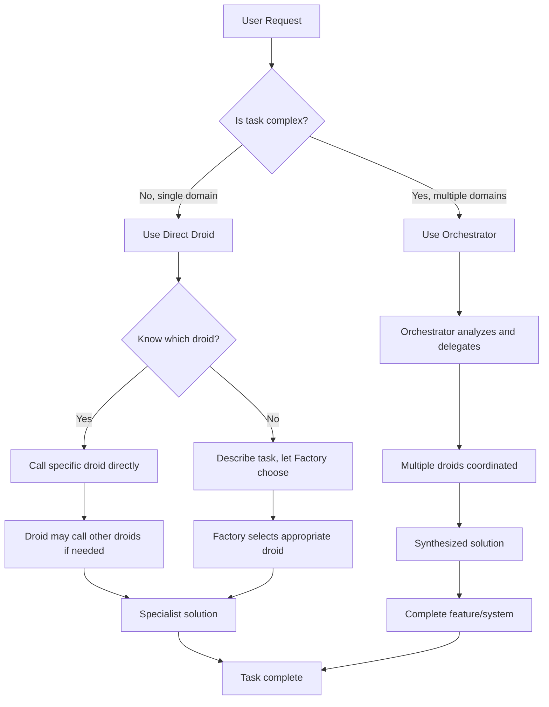

# Droids vs Orchestrator - Key Differences

## 🎯 The Core Difference

### Individual Droids
**Specialists** who are experts in ONE domain
- Focus on their specific area (frontend, backend, security, etc.)
- Work independently when given a task in their specialty
- Can call other droids when they need help with something outside their expertise

### Orchestrator  
**Project Manager** who coordinates multiple specialists
- Analyzes the entire task complexity
- Breaks down complex tasks into sub-tasks
- Assigns the right droids to each sub-task
- Manages the overall workflow and ensures everything integrates properly

---

## 📊 Comparison Table

| Aspect | Individual Droids | Orchestrator |
|--------|------------------|-------------|
| **Primary Role** | Specialist in one domain | Coordinator of multiple domains |
| **Scope** | Single specialty (frontend, backend, security, etc.) | Cross-domain, project-level |
| **Decision Making** | Technical decisions in their field | Strategic planning and resource allocation |
| **When Used** | Clear, single-domain tasks | Complex, multi-domain tasks |
| **Coordination** | Can call other droids when needed | Coordinates multiple droids by design |
| **Output** | Code, configs, documentation | Integrated solution, synthesis of all parts |

---

## 🛠️ How Individual Droids Work

### When to Use Directly
```bash
# Task is clearly in one domain
@frontend-developer "Create a contact form component"
@backend-architect "Design REST API for user management"
@security-auditor "Review authentication implementation"
@test-automator "Create unit tests for payment service"
```

### How Droids Can Call Other Droids
**Frontend developer working on a payment form:**
```
Frontend-developer: "I need to create a payment form, but I'm not sure about the security requirements."

→ Can call security-auditor: "Review security requirements for payment forms"
→ Can call backend-architect: "Confirm payment API endpoints and data format"
→ Then implements the form with that information
```

**Backend architect designing APIs:**
```
Backend-architect: "I need to design user auth API, but want to ensure it's secure."

→ Can call security-auditor: "Design secure authentication flow"
→ Can call database-admin: "Design user database schema"
→ Then creates the complete API design
```

### Droid-to-Droid Collaboration Examples

**Example 1: Frontend Developer Needs Help**
```
1. User asks: @frontend-developer "Create a complex dashboard with real-time charts"

2. Frontend-developer thinks: "This requires data visualization and real-time updates. I should get help."

3. Frontend-developer calls:
   → @data-analyst: "Help design chart data structure and metrics"
   → @backend-typescript-architect: "Create WebSocket API for real-time data"
   
4. Frontend-developer then creates the dashboard using:
   - Chart designs from data-analyst
   - Real-time API from backend-typescript-architect
```

**Example 2: Backend Architect Needs Help**
```
1. User asks: @backend-architect "Design payment processing system"

2. Backend-architect thinks: "Payment processing needs security and payment gateway expertise."

3. Backend-architect calls:
   → @security-auditor: "Design secure payment flow"
   → @payment-integration: "Integrate Stripe payment processing"
   
4. Backend-architect then creates the complete API design using:
   - Security requirements from security-auditor
   - Payment integration details from payment-integration
```

---

## 🎭 How Orchestrator Works

### When to Use Orchestrator
```bash
# Task involves multiple domains
@orchestrator "Build complete user authentication system"
@orchestrator "Create e-commerce platform with products and payments"  
@orchestrator "Build real-time chat application with mobile apps"
```

### Orchestrator's Process
```
1. User Request: "Build user authentication system"

2. Orchestrator Analysis:
   - Complexity: Medium
   - Domains: Security, Backend, Frontend, Testing
   - Strategy: Sequential pipeline

3. Orchestrator Creates Plan:
   Phase 1: Security Design → security-auditor
   Phase 2: Backend Architecture → backend-architect
   Phase 3: Backend Implementation → backend-typescript-architect
   Phase 4: Frontend Implementation → frontend-developer
   Phase 5: Testing → test-automator
   Phase 6: Security Review → security-auditor

4. Orchestrator Executes:
   - Calls security-auditor with context
   - Gets security design back
   - Calls backend-architect with security context
   - Gets API design back
   - Calls backend-typescript-architect with API context
   - Gets implementation back
   - ...and so on...

5. Orchestrator Synthesizes:
   - Combines all outputs
   - Checks for integration issues
   - Creates final documentation
   - Provides testing instructions
```

---

## 🔄 Key Differences in Practice

### Scenario 1: Adding a Contact Form

**Direct Droid Approach:**
```bash
@frontend-developer "Create a contact form with name, email, message fields"

# Frontend-developer:
# - Creates the form component
# - Might call security-auditor for XSS protection
# - Might call backend-architect for API endpoint
# - Delivers complete contact form
```

**Orchestrator Approach:**
```bash
@orchestrator "Add a complete contact form system with backend and validation"

# Orchestrator:
# Phase 1: backend-architect designs API
# Phase 2: security-auditor reviews security
# Phase 3: backend-typescript-architect implements API
# Phase 4: frontend-developer creates form
# Phase 5: test-automator creates tests
# Phase 6: orchestrator synthesizes everything
```

### Scenario 2: Bug Fix

**Direct Droid Approach:**
```bash
@debugger "Login button is not working, investigate and fix"

# Debugger:
# - Analyzes the issue
# - Might call frontend-developer if it's a UI issue
# - Might call backend-architect if it's an API issue
# - Fixes the problem
```

**Orchestrator Approach:**
```bash
@orchestrator "Investigate and fix login system issues"

# Orchestrator:
# Phase 1: debugger investigates the issue
# Phase 2: Based on findings, delegates fix to appropriate droid
# Phase 3: test-automator verifies fix works
# Phase 4: orchestrator coordinates everything
```

---

## 🎯 When to Use Which

### ✅ Use Individual Droids When:
- Task is clearly in one domain
- You know exactly which specialist you need
- Simple, well-defined requirements
- Quick fixes or specific features
- User explicitly requests a specific droid

**Examples:**
```bash
@frontend-developer "Create a modal component"
@backend-architect "Design API endpoints for blog posts"
@security-auditor "Review SQL injection vulnerabilities"
@test-automator "Create unit tests for user service"
```

### ✅ Use Orchestrator When:
- Task spans multiple technical domains
- Complex requirements need coordination
- Quality review and testing needed
- User request is ambiguous or complex
- Complete feature or system development

**Examples:**
```bash
@orchestrator "Build complete user authentication system"
@orchestrator "Create e-commerce platform with inventory management"
@orchestrator "Develop real-time chat application"
@orchestrator "Build a blog system with comments and categories"
```

---

## 🤖 Droid-to-Droid vs Orchestrator-to-Droid

### Droid-to-Droid Collaboration
- **Initiated by** specialist droid when they need help
- **Scope** limited to what the specialist needs
- **Purpose** fill knowledge gaps in their work
- **Example**: Frontend developer calls security-auditor for input validation

### Orchestrator-to-Droid Coordination  
- **Initiated by** orchestrator as part of master plan
- **Scope** covers entire project or feature
- **Purpose** complete implementation with quality control
- **Example**: Orchestrator coordinates security → backend → frontend → testing

---

## 🎪 Real-World Comparison

### Individual Droids = Specialized Contractors
- **Plumber**: Fixes plumbing issues
- **Electrician**: Handles electrical work  
- **Carpenter**: Builds wooden structures
- **When they need help**: They might call each other (electrician asks plumber about water heater)

### Orchestrator = General Contractor
- **Analyzes**: What's needed for the whole house
- **Coordinates**: Plumber, electrician, carpenter, painter
- **Manages**: Timeline, dependencies, quality control
- **Delivers**: Complete house with all systems working together

---

## 📈 Benefits of Each Approach

### Individual Droids
✅ **Faster** for simple, single-domain tasks
✅ **More direct** communication with specialist
✅ **Less overhead** for small tasks
✅ **Specialist focus** on their area of expertise

### Orchestrator
✅ **Better coordination** for complex tasks
✅ **Quality control** with multiple review phases
✅ **Integration management** between components
✅ **Complete solution** from architecture to testing
✅ **Error handling** and fallback strategies

---

## 🎯 Decision Flow



---

## 🎉 Summary

- **Individual Droids**: Specialists you call directly for their expertise
- **Orchestrator**: Project manager who coordinates multiple specialists for complex tasks
- **Droids can call other droids** when they need help outside their expertise
- **Orchestrator calls droids by design** as part of a coordinated plan
- **Choose based on task complexity** and how many domains are involved

**Simple rule of thumb:**
- One domain → Use droid directly
- Multiple domains → Use orchestrator
